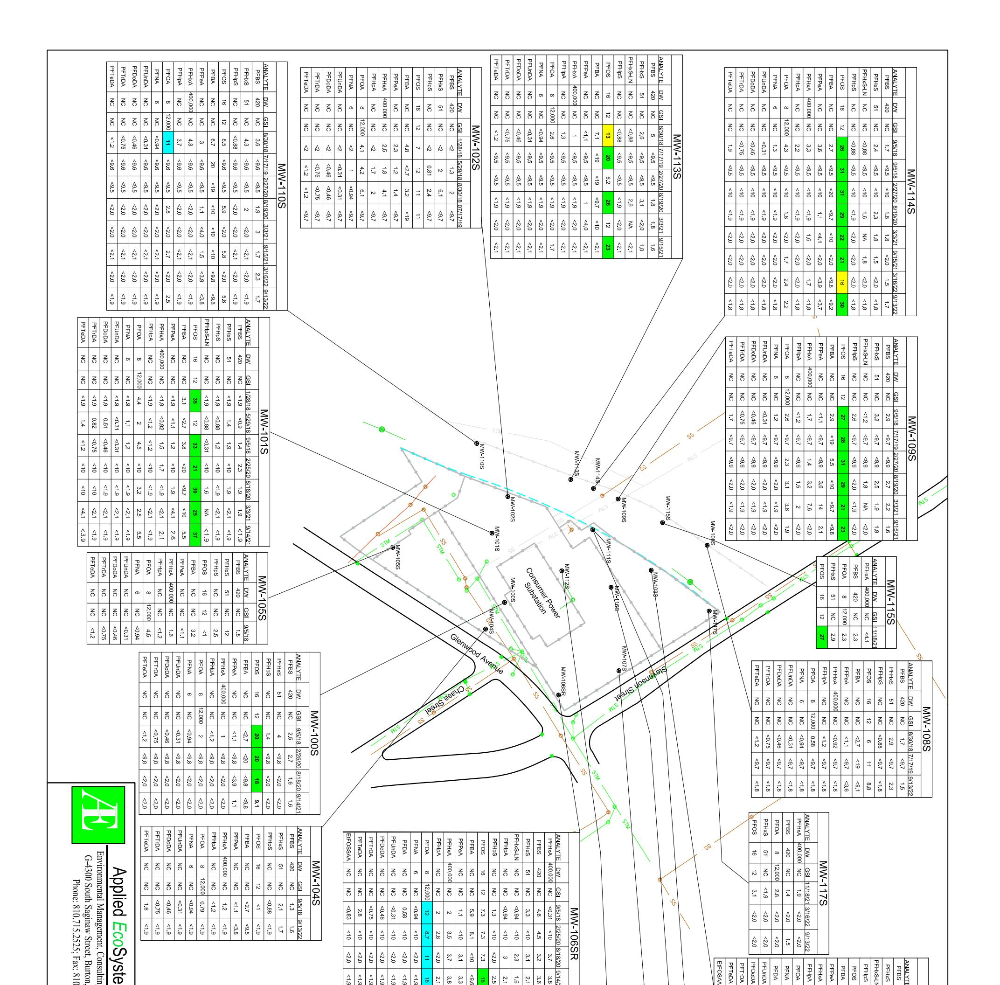

**Table 1**Groundwater Analytical Results
RACER - Flint West # 12990

|                                     |           | Sample l             | ID MW-100S    | MW-101S    | MW-102S    | MW-103S    | MW-104S    | MW-105S    | MW-106SR           | MW-107S    | MW-108S    | MW-109     | MW-110S    | MW-111S    | MW-112S    | MW-113S    | MW-114S    | Dupe 1     | Dupe 2     | Field Blank | Equip Blank | Field Blank | Equipment Blank | Trip       | Equip              | Field        |
|-------------------------------------|-----------|----------------------|---------------|------------|------------|------------|------------|------------|--------------------|------------|------------|------------|------------|------------|------------|------------|------------|------------|------------|----------------|----------------|----------------|--------------------|------------|--------------------|--------------|
|                                     |           | Date Collecte        | ed 02/25/2020 | 02/25/2020 | 02/25/2020 | 02/28/2020 | 02/25/2020 | 02/25/2020 | 02/25/2020         | 02/25/2020 | 02/27/2020 | 02/27/2020 | 02/27/2020 | 02/27/2020 | 02/27/2020 | 02/27/2020 | 02/27/2020 | 02/27/2020 | 02/27/2020 |                | 02/25/2020     | 02/27/2020     | 02/27/2020         | 02/28/2020 | 02/28/2020         | 0 02/28/2020 |
| METALS ANALYTE (ug/L)               | DW        | GSI                  | 12,20,2020    |            | ,,         |            |            |            |                    |            |            |            |            | /          |            |            |            |            | MW-114S    |                |                | ,_,,2020       |                    |            |                    |              |
| Arsenic, Dissolved                  | 10        | 10                   | <0.002        | <0.002     | <0.002     | 4          | <0.002     | <0.002     | <0.002             | <0.002     | 0.257      | 9          | 0.518      | <0.002     | 13         | 1.511      | 25         | 13         | 24         | NA             | NA             | NA             | NA                 | NA         | NA                 | NA           |
| Arsenic                             | 10        | 10                   | <0.002        | <0.002     | <0.002     | 46         | <0.002     | 0.316      | 1.173              | 0.465      | <0.002     | 69         | 2          | 0.998      | 41         | 3          | 62         | 43         | 69         | NA             | NA             | NA             | NA                 | NA         | NA                 | NA           |
| Chromium, Dissolved                 | 100       | 160                  | G 0.275       | 0.891      | 7          | 0.204      | 0.562      | 0.463      | 0.719              | <0.005     | 0.295      | 0.138      | 0.312      | 6          | 0.214      | 0.518      | 13         | 0.39       | <0.005     | NA             | NA             | NA             | NA                 | NA         | NA                 | NA           |
| Chromium                            | 100       | 160                  | G 0.42        | 2.753      | 6          | 0.388      | 16         | 280        | 764                | 0.185      | 0.431      | 1.767      | 0.862      | 6          | 0.349      | 6          | 0.97       | 0.356      | 1.084      | NA             | NA             | NA             | NA                 | NA         | NA                 | NA           |
| Chromium VI, Dissolved              | 100       | 160                  | <0.005        | <0.005     | 8          | <0.01      | <0.005     | <0.005     | <0.005             | <0.005     | <0.005     | <0.005     | <0.005     | <0.005     | 4          | <0.005     | <0.005     | <0.005     | <0.005     | NA             | NA             | NA             | NA                 | NA         | NA                 | NA           |
| Chromium VI                         | 100       | 160                  | <0.01         | <0.01      | <0.01      | <0.02      | <0.01      | <0.01      | <0.01              | 4          | <0.025     | <0.5       | <0.5       | <0.5       | <0.5       | <0.025     | <0.5       | <0.5       | <0.5       | NA             | NA             | NA             | NA                 | NA         | NA                 | NA           |
| Copper, Dissolved                   | 1000      | 20                   | G 0.405       | <0.005     | <0.005     | <0.005     | 3.473      | 0.396      | 0.576              | 0.86       | 1.357      | <0.005     | <0.005     | 0.501      | <0.005     | 0.492      | 0.751      | 0.391      | 0.611      | NA             | NA             | NA             | NA                 | NA         | NA                 | NA           |
| Copper                              | 1000      | 20                   | G <0.005      | 0.698      | 0.516      | 0.528      | 9          | 6          | 14                 | 0.996      | 0.564      | <0.005     | 0.835      | 0.694      | <0.005     | 0.973      | 6          | <0.005     | 6          | NA             | NA             | NA             | NA                 | NA         | NA                 | NA           |
| Lead, Dissolved                     | 4         | 44                   | G <0.003      | <0.003     | <0.003     | 0.208      | <0.003     | <0.003     | <0.003             | <0.003     | <0.003     | <0.003     | <0.003     | <0.003     | <0.003     | <0.003     | <0.003     | 0.584      | <0.003     | NA             | NA             | NA             | NA                 | NA         | NA                 | NA           |
| Lead                                | 4         | 44                   | G 0.249       | 0.283      | <0.003     | <0.003     | <0.003     | <0.003     | 0.886              | 0.283      | <0.003     | <0.003     | 0.242      | 0.339      | <0.003     | 0.4        | 4          | <0.003     | 4          | NA             | NA             | NA             | NA                 | NA         | NA                 | NA           |
| Selenium, Dissolved                 | 50        | 5                    | <0.005        | <0.005     | <0.005     | <0.005     | <0.005     | 9          | <0.005             | <0.005     | <0.005     | <0.005     | <0.005     | <0.005     | <0.005     | <0.005     | <0.005     | <0.005     | <0.005     | NA             | NA             | NA             | NA                 | NA         | NA                 | NA           |
| Selenium                            | 50        | 5                    | <0.005        | <0.005     | <0.005     | <0.005     | <0.005     | 9          | <0.005             | <0.005     | <0.005     | <0.005     | <0.005     | <0.005     | <0.005     | <0.005     | <0.005     | <0.005     | <0.005     | NA             | NA             | NA             | NA                 | NA         | NA                 | NA           |
| Zinc, Dissolved                     | 2400      | 260                  | G 6           | 4.654      | 5          | 2.299      | 9          | 1.504      | 1.216              | 9          | 7          | 3.151      | 3.037      | 6          | 2.665      | 8          | 27         | 6          | 29         | NA             | NA             | NA             | NA                 | NA         | NA                 | NA           |
| Zinc                                | 2400      | 260                  | G 1.56        | 2.074      | 1.632      | 2.05       | 14         | 1.948      | 7                  | 6          | 2.742      | 2.004      | 1.879      | 1.594      | 1.588      | 6          | 44         | 1.221      | 43         | NA             | NA             | NA             | NA                 | NA         | NA                 | NA           |
| VOC ANALYTE (ug/L)                  | DW        | GSI                  |               |            |            |            |            |            |                    |            |            |            |            |            |            |            |            |            | MW-114S    |                |                |                |                    |            |                    | للجسم        |
| Diethyl ether                       | 10 (E)    | ID                   | <10           | <10        | <10        | <10        | <10        | <10        | <10                | <10        | <10        | <10        | <10        | <10        | <10        | <10        | <10        | <10        | <10        | <10            | <10            | <10            | <10                | <10        | <10                | <10          |
| Acetone                             | 730       | 1,700                | <50           | <50        | <50        | <50        | <50        | <50        | <50                | <50        | <50        | <50        | <50        | <50        | <50        | <50        | <50        | <50        | <50        | <50            | <50            | <50            | <50                | <50        | <50                | <50          |
| Methyl iodide                       | NC        | NC                   | <1            | <1         | <1         | <1         | <1         | <1         | <1                 | <1         | <1         | <1         | <1         | <1         | <1         | <1         | <1         | <1         | <1         | <1             | <1             | <1             | <1                 | <1         | <1                 | <1           |
| Carbon disulfide                    | 800       | NC                   | <5 45      | <5      | <5         | 0.26       | <5      | <5         | <5              | <5         | <5         | <5      | <5      | <5      | <5 -45  | <5         | <5      | <5 -45  | <5         | <5             | <5             | <5          | 0.15               | 0.18       | 0.17               | 0.17         |
| tert-Methyl butyl ether (MTBE)      | . ,       | 7,100 (X)            | <5            | <5         | <5         | <5         | <5         | <5         | <5                 | <5         | <5         | <5         | <5         | <5         | <5         | <5         | <5         | <5         | <5         | <5             | <5             | <5             | <5                 | <5         | <5                 | <5           |
| Acrylonitrile                       | 2.6       | 2.0 (M); 1.2         | <2            | <2         | <2         | <2         | <2         | <2         | <2                 | <2         | <2         | <2         | <2         | <2         | <2         | <2         | <2         | <2         | <2         | <2             | <2             | <2             | <2                 | <2         | <2                 | <2           |
| 2-Butanone (MEK)                    | 13,000    | 2,200                | <25           | <25        | <25        | <25        | <25        | <25        | <25                | <25        | <25        | <25        | <25        | <25        | <25        | <25        | <25        | <25        | <25        | <25            | <25            | <25            | <25                | <25        | <25                | <25          |
| Dichlorodifluoromethane             | 1,700     | ID                   | <5 0.15    | <5         | <5         | <5         | <5         | <5         | <5 <5           | <5         | <5         | <5         | <5         | <5         | <5         | <5         | <5         | <5         | <5         | <5             | <5             | <5             | <5 <5           | <5         | <5 -5           | <5           |
| Chloromethane                       | 260       | NC                   | 0.15          | <5         | <5         | <5 0.91 | <5 <1   | <5         | <5 <1           | <5         | <5         | 0.13       | <5         | <5         | <5 40   | 0.44       | <5         | <5 44   | <5 2    | <5 <1       | <5             | <5             | <5                 | <5         | <5                 | <5           |
| Vinyl chloride                      | 2         | 13                   | <1            | <1         | <1         | 0.81       | <1         | <1 <5   | <1                 | <1         | <1         | 18         | <1         | <1         | 10         | 0.79       | 5          | 11         | 3          | <1             | <1             | <1             | <1 <5           | <1         | <1                 | <1           |
| Bromomethane                        | 10 430 | 4.2; [5(M)] 1.100 | <5 <5      | <5 <5   | <5 <5   | <5 <5   | <5 <5   | <5 <5   | <5 <5           | <5 <5   | <5 <5   | <5 <5   | <5 <5   | <5 <5   | <5 <5   | <5 <5   | <5 <5   | <5 <5   | <5 <5   | <5 <5       | <5 <5       | <5 <5       | <5 <5           | <5 0.39 | <5 <5           | <5 <5     |
| Chloroethane Trichlorofluoromethane | 2.600     | 1,100 NA          | <5 <1      | <5 <1   | <5 <1   | <5 <1   | <5 <1   | <5 <1   | <u>&lt;5</u> <1 | <5 <1   | <5 <1   | <5 <1   | <5 <1   | <5 <1   | <5 <1   | <5 <1   | <5 <1   | <5 <1   | <5 <1   | <5 <1       | <5 <1       | <5 <1       | <5 <1           | 0.39 <1 | <u>&lt;5</u> <1 | <5           |
| 1,1-Dichloroethene                  | 2,000     | 130                  | <1            | <1         | <1         | <1         | <1         | <1         | <u> </u>           | <1         | <1         | 1          | <1         | <1         | 1          | <1         | 0.84       | 1          | 0.82       | <1             | <1             | <1             | <1                 | <1         | <1                 | <1           |
| Methylene chloride                  | 5         | 1.500                | <5            | <5         | <5         | <5         | <5         | <5         | <u> </u>           | <5         | <5         | <5         | <5         | <5         | 0.11       | <5         | <5         | 0.13       | <5         | 0.43           | 0.41           | 0.36           | 0.76               | 0.22       | 0.36               | 0.45         |
| trans-1,2-Dichloroethene            | 100       | 1,500                | <1            | <1         | <1         | <1         | <1         | <1         | <u> </u>           | <1         | <1         | 0.5        | <1         | <1         | 0.11       | <1         | 0.78       | 0.13       | 0.83       | <1             | <1             | <1             | <1                 | <1         | <u> </u>           | <1           |
| 1,1-Dichloroethane                  | 880       | 740                  | <1            | <1         | <1         | <1         | <1         | <1         | <1                 | <1         | <1         | 1          | <1         | <1         | 0.20       | <1         | 3          | 1          | 2          | <1             | <1             | <1             | <1                 | <1         | <1                 | <1           |
| cis-1,2-Dichloroethene              | 70        | 620                  | 9             | <1         | <1         | <1         | <1         | <1         | <1                 | 0.11       | <1         | 17         | <1         | 0.35       | 3          | 0.44       | 127        | 3          | 125        | <1             | <1             | <1             | <1                 | <1         | <1                 | <1           |
| Tetrahydrofuran                     | 95        | 11,000               | <90           | <90        | <90        | <90        | <90        | <90        | <90                | <90        | <90        | <90        | <90        | <90        | <90        | <90        | <90        | <90        | <90        | <90            | 0.22           | <90            | <90                | <90        | <90                | <90          |
| Chloroform                          | 80        | 350                  | <1            | <1         | <1         | <1         | 0.71       | <1         | 0.24               | <1         | 0.81       | <1         | <1         | <1         | <1         | <1         | 0.22       | <1         | 0.23       | <1             | <1             | <1             | <1                 | <1         | <del></del>        | <1           |
| Bromochloromethane                  | NC        | NC                   | <1            | <1         | <1         | <1         | <1         | <1         | <1                 | <1         | <1         | <1         | <1         | <1         | <1         | <1         | <1         | <1         | <1         | <1             | <1             | <1             | <1                 | <1         | <1                 | <1           |
| 1,1,1-Trichloroethane               | 200       | 89                   | <1            | <1         | <1         | <1         | <1         | <1         | <1                 | <1         | <1         | <1         | <1         | <1         | <1         | <1         | 2          | <1         | 2          | <1             | <1             | <1             | <1                 | <1         | <1                 | <1           |
| 4-Methyl-2-pentanone (MIBK)         | 1800      | ID                   | <50           | <50        | <50        | <50        | <50        | <50        | <50                | <50        | <50        | <50        | <50        | <50        | <50        | <50        | <50        | <50        | <50        | <50            | <50            | <50            | <50                | <50        | <50                | <50          |
| 2-Hexanone                          | 1000      | ID                   | <50           | <50        | <50        | <50        | <50        | <50        | <50                | <50        | <50        | <50        | <50        | <50        | <50        | <50        | <50        | <50        | <50        | <50            | <50            | <50            | <50                | <50        | <50                | <50          |
| Carbon tetrachloride                | 5.0       | 38                   | X <1          | <1         | <1         | <1         | <1         | <1         | <1                 | <1         | 2          | <1         | <1         | <1         | <1         | <1         | <1         | <1         | <1         | <1             | <1             | <1             | <1                 | <1         | <1                 | <1           |
| Benzene                             | 5.0       | 200                  | <1            | <1         | <1         | 0.26       | <1         | <1         | <1                 | <1         | <1         | <1         | <1         | <1         | 0.2        | <1         | <1         | 0.22       | <1         | <1             | <1             | <1             | <1                 | <1         | <1                 | <1           |
| 1,2-Dichloroethane                  | 5.0 (A)   | 360 (X)              | <1            | <1         | <1         | <1         | <1         | <1         | <1                 | <1         | <1         | <1         | <1         | <1         | <1         | <1         | <1         | <1         | <1         | <1             | <1             | <1             | <1                 | <1         | <1                 | <1           |
| Trichloroethene                     | 5.0       | 200                  | 16            | 2          | 0.16       | <1         | <1         | <1         | <1                 | 0.15       | 0.14       | 13         | <1         | 6          | 6          | 7          | 335        | 6          | 350        | <1             | <1             | <1             | <1                 | <1         | <1                 | <1           |
| 1,2-Dichloropropane                 | 5.0 (A)   | 230 (X)              | <1            | <1         | <1         | <1         | <1         | <1         | <1                 | <1         | <1         | <1         | <1         | <1         | <1         | <1         | <1         | <1         | <1         | <1             | <1             | <1             | <1                 | <1         | <1                 | <1           |
| Bromodichloromethane                | 80.0      | NC                   | <1            | <1         | <1         | <1         | 0.17       | <1         | <1                 | <1         | <1         | <1         | <1         | <1         | <1         | <1         | <1         | <1         | <1         | <1             | <1             | <1             | <1                 | <1         | <1                 | <1           |
| Dibromomethane                      | 230       | NA                   | <5            | <5         | <5         | <5         | <5         | <5         | <5                 | <5         | <5         | <5         | <5         | <5         | <5         | <5         | <5         | <5         | <5         | <5             | <5             | <5             | <5                 | <5         | <5                 | <5           |
| cis-1,3-Dichloropropene             | NC        | NC                   | <1            | <1         | <1         | <1         | <1         | <1         | <1                 | <1         | <1         | <1         | <1         | <1         | <1         | <1         | <1         | <1         | <1         | <1             | <1             | <1             | <1                 | <1         | <1                 | <1           |
| Toluene                             | 790       | 270                  | <1            | <1         | <1         | <1         | <1         | <1         | <1                 | <1         | <1         | <1         | <1         | <1         | <1         | <1         | <1         | <1         | <1         | <1             | <1             | <1             | <1                 | <1         | <1                 | <1           |
| trans-1,3-Dichloropropene           | NC        | NC                   | <1            | <1         | <1         | <1         | <1         | <1         | <1                 | <1         | <1         | <1         | <1         | <1         | <1         | <1         | <1         | <1         | <1         | <1             | <1             | <1             | <1                 | <1         | <1                 | <1           |
| 1,1,2-Trichloroethane               | 5.0 (A)   | 330 (X)              | <1            | <1         | <1         | <1         | <1         | <1         | <1                 | <1         | <1         | <1         | <1         | <1         | <1         | <1         | <1         | <1         | <1         | <1             | <1             | <1             | <1                 | <1         | <1                 | <1           |
| Tetrachloroethene                   | 5.0       | 60                   | <1            | <1         | <1         | <1         | <1         | 78         | <1                 | <1         | <1         | <1         | <1         | <1         | <1         | <1         | 0.2        | <1         | 0.18       | <1             | <1             | <1             | <1                 | <1         | <1                 | <1           |
| trans-1,4-Dichloro-2-butene         | NC        | NC                   | <1            | <1         | <1         | <1         | <1         | <1         | <1                 | <1         | <1         | <1         | <1         | <1         | <1         | <1         | <1         | <1         | <1         | <1             | <1             | <1             | <1                 | <1         | <1                 | <1           |
|                                     | 80 (A,W)  | ID                   | <5            | <5         | <5         | <5         | <5         | <5         | <5                 | <5         | <5         | <5         | <5         | <5         | <5         | <5         | <5         | <5         | <5         | <5             | <5             | <5             | <5                 | <5         | <5                 | <5           |
| 1,2-Dibromoethane                   | NC        | NC                   | <1            | <1         | <1         | <1         | <1         | <1         | <1                 | <1         | <1         | <1         | <1         | <1         | <1         | <1         | <1         | <1         | <1         | <1             | <1             | <1             | <1                 | <1         | <1                 | <1           |
| Chlorobenzene                       | 100       | 25                   | <1            | <1         | <1         | 0.53       | <1         | <1         | <1                 | <1         | <1         | <1         | <1         | <1         | <1         | <1         | <1         | <1         | <1         | <1             | <1             | <1             | <1                 | <1         | <1                 | <1           |
| 1,1,1,2-Tetrachloroethane           | 77        | ID                   | <1            | <1         | <1         | <1         | <1         | <1         | <1                 | <1         | <1         | <1         | <1         | <1         | <1         | <1         | <1         | <1         | <1         | <1             | <1             | <1             | <1                 | <1         | <1                 | <1           |

**Table 1**Groundwater Analytical Results
RACER - Flint West # 12990

|                             |        | Sample        | 10              | ЛW- 00S | MW- 101S | MW- 102S | MW- 103S | MW- 104S | MW- 105S | MW- 106SR | MW- 107S | MW- 108S | MW- 109S | MW- 110S | MW- 111S | MW- 112S | MW- 113S | Field Dupe | Trip | Field Blank | Equip Blank |
|-----------------------------|--------|---------------|-----------------|------------|-------------|-------------|-------------|-------------|-------------|--------------|-------------|-------------|-------------|-------------|-------------|-------------|-------------|------------|------|----------------|----------------|
|                             |        | Date Collecte | . <b>ed</b> 5/2 | 29/18      | 5/29/18     | 5/29/18     | 5/29/18     | 5/29/18     | 5/29/18     | 5/29/18      | 5/29/18     | 5/29/18     | 5/29/18     | 5/29/18     | 5/29/18     | 5/29/18     | 5/29/18     | 5/29/18    |      | 5/29/18        | 5/29/18        |
| METALS ANALYTE (ug/L)       | DW     | GSI           | D               | DRY        |             |             |             | DRY         |             | DRY          |             | NS          | NS          | NS          |             |             | NS          | MW-102S    |      |                |                |
| Arsenic (dissolved)         | 10     | 10            |                 |            |             |             | 1.41        |             |             |              |             |             |             |             |             | 23          |             |            |      |                |                |
| Arsenic                     | 10     | 10            |                 |            |             |             | 9           |             |             |              |             |             |             |             |             | 60          |             |            |      |                |                |
| Chromium (dissolved)        | 100    |               | G               |            | 1.62        | 14          | 0.168       |             | 1.01        |              | 0.328       |             |             |             | 4.13        | 0.431       |             | 14         |      |                |                |
| Chromium (total)            | 100    |               | G               |            | 2.64        | 14          | 0.276       |             | 44          |              | 0.208       |             |             |             | 4.17        | 0.296       |             | 14         |      |                | 0.095          |
| Chromium VI (dissolved)     | 100    | 160           |                 |            |             |             |             |             |             |              |             |             |             |             |             |             |             |            |      |                |                |
| Chromium VI (total)         | 100    | 160           |                 |            |             |             |             |             |             |              |             |             |             |             |             |             |             |            |      |                |                |
| Copper (dissolved)          | 1000   |               | G               |            | 0.381       | 0.498       |             |             | 0.816       |              | 1.73        |             |             |             | 0.611       |             |             | 0.469      |      |                |                |
| Copper                      | 1000   |               | G               |            | 0.748       | 0.341       |             |             | 1.78        |              | 1.43        |             |             |             | 2.42        |             |             |            |      |                |                |
| Lead (dissolved)            | 4      |               | G               |            |             |             |             |             |             |              |             |             |             |             |             |             |             |            |      |                |                |
| Lead                        | 4      |               | G               |            | 0.408       |             | 0.068       |             | 0.304       |              | 0.121       |             |             |             | 0.067       | 0.062       |             |            |      |                |                |
| Selenium (dissolved)        | 50     | 5             |                 |            |             |             |             |             |             |              |             |             |             |             |             |             |             |            |      |                |                |
| Selenium                    | 50     | 5             |                 |            |             |             |             |             |             |              |             |             |             |             |             |             |             |            |      |                |                |
| Zinc (dissolved)            | 2400   |               | G               |            | 6           | 8           | 7           |             | 8           |              | 12          |             |             |             | 15          | 8           |             | 9          |      |                |                |
| Zinc                        | 2400   |               | G               |            | 6           | 7           | 8           |             | 7           |              | 8           |             |             |             | 6           | 4.76        |             | 9          |      |                | 1.79           |
| VOC ANALYTE (ug/L)          | DW     | GSI           |                 |            |             |             |             |             |             |              |             |             |             |             |             |             |             |            |      |                |                |
| Acetone                     | 730    | 1,700         |                 |            | 5           | 4.5         | 6.4         |             | 5.6         |              |             |             |             |             | 5.9         | 8.2         |             | 5.6        | 4.8  |                | 8.4            |
| Methyl iodide               | NC     | NC            |                 |            |             |             |             |             |             |              |             |             |             |             |             |             |             |            |      |                |                |
| Carbon disulfide            | 800    | NC            |                 |            |             |             |             |             |             |              |             |             |             |             |             |             |             |            |      |                |                |
| 2 Butanone (MEK)            | 13,000 | 2,200         |                 |            |             |             |             |             |             |              |             |             |             |             |             |             |             |            |      |                |                |
| Chloromethane               | 260    | NC            |                 |            |             |             |             |             |             |              |             |             |             |             |             |             |             |            |      |                |                |
| Vinyl Chloride              | 2.0    | 13            |                 |            |             |             |             |             |             |              |             |             |             |             |             | 9           |             |            |      |                |                |
| Chloroethane                | 430    | 1,100         |                 |            |             |             |             |             |             |              |             |             |             |             |             |             |             |            |      |                |                |
| trichlorofluoromethane      | 2,600  | NA            |                 |            |             |             |             |             |             |              |             |             |             |             |             |             |             |            |      |                |                |
| 1,1-Dichloroethene          | 7.0    | 130           |                 |            |             |             |             |             |             |              |             |             |             |             |             | 1           |             |            |      |                |                |
| Methylene Chloride          | 5.0    | 1,500         |                 |            |             |             |             |             |             |              |             |             |             |             |             | 0.17        |             |            |      |                |                |
| trans-1,2-Dichloroethene    | 100    | 1,500         |                 |            |             |             |             |             |             |              |             |             |             |             |             | 0.25        |             |            |      |                |                |
| 1,1-Dichloroethane          | 880    | 740           |                 |            |             |             |             |             |             |              |             |             |             |             |             | 1           |             |            |      |                |                |
| cis-1,2-Dichloroethene      | 70     | 620           |                 |            |             |             |             |             |             |              |             |             |             |             |             | 3           |             |            |      |                |                |
| Tetrahydrofuran             | 95     | 11,000        |                 |            |             |             |             |             |             |              |             |             |             |             |             |             |             |            | 4.8  |                |                |
| Chloroform                  | 80     | 350           |                 |            |             |             |             |             |             |              |             |             |             |             |             |             |             |            |      |                | 0.46           |
| 1,1,1-Trichloroethane       | 200    | 89            |                 |            |             |             |             |             |             |              |             |             |             |             |             |             |             |            |      |                |                |
| 4-Methyl-2-pentanone (MIBK) | 1800   | ID            |                 |            |             |             |             |             |             |              |             |             |             |             |             |             |             |            |      |                |                |
| 2-Hexanone                  | 1000   | ID            |                 |            |             |             |             |             |             |              |             |             |             |             |             |             |             |            |      |                |                |
| Carbon tetrachloride        | 5.0    | 38 (X)        |                 |            |             |             |             |             |             |              |             |             |             |             |             |             |             |            |      |                |                |
| Benzene                     | 5.0    | 200           |                 |            |             |             |             |             |             |              |             |             |             |             |             | 0.20        |             |            |      |                |                |
| Bromodichloromethane        | 80.0   | NC            |                 |            |             |             |             |             |             |              |             |             |             |             |             |             |             |            |      |                |                |
| Trichloroethene             | 5.0    | 200           |                 |            | 1           | 0.67        |             |             |             |              |             |             |             |             | 7           | 13          |             | 0.7        |      |                |                |
| Toluene                     | 790    | 270           |                 |            |             | 0.39        |             |             |             |              |             |             |             |             |             |             |             |            |      |                |                |
| Tetrachloroethene           | 5.0    | 60            |                 |            |             |             |             |             | 45          |              |             |             |             |             |             |             |             |            |      |                |                |
| Chlorobenzene               | 100    | 25            |                 |            |             |             |             |             |             |              |             |             |             |             |             |             |             |            |      |                |                |
| Styrene                     | 100    | 80            |                 |            |             |             |             |             |             |              |             |             |             |             |             |             |             |            |      |                |                |

